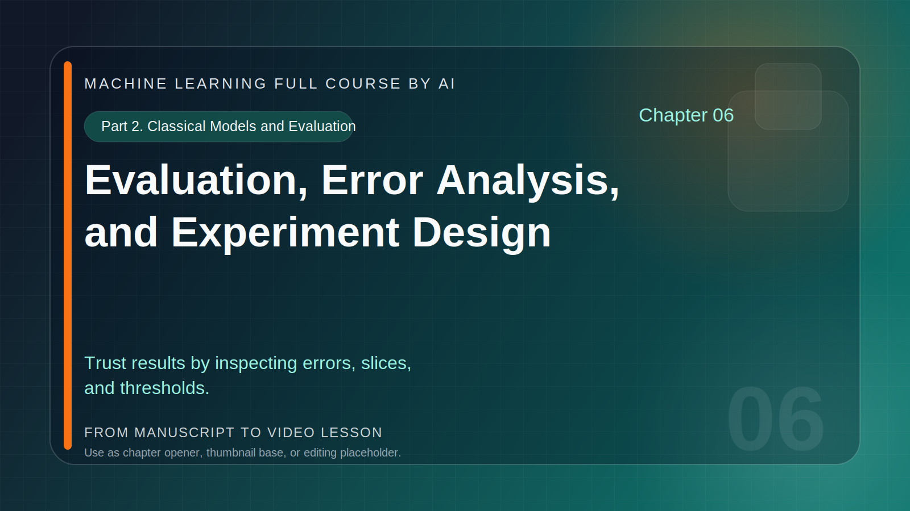
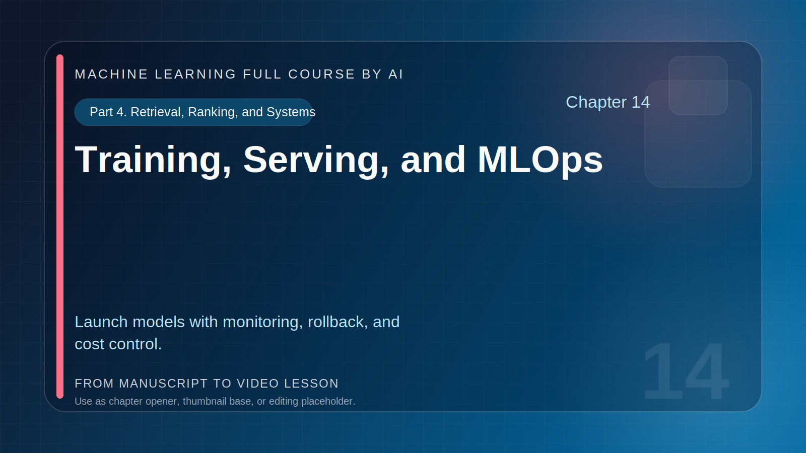
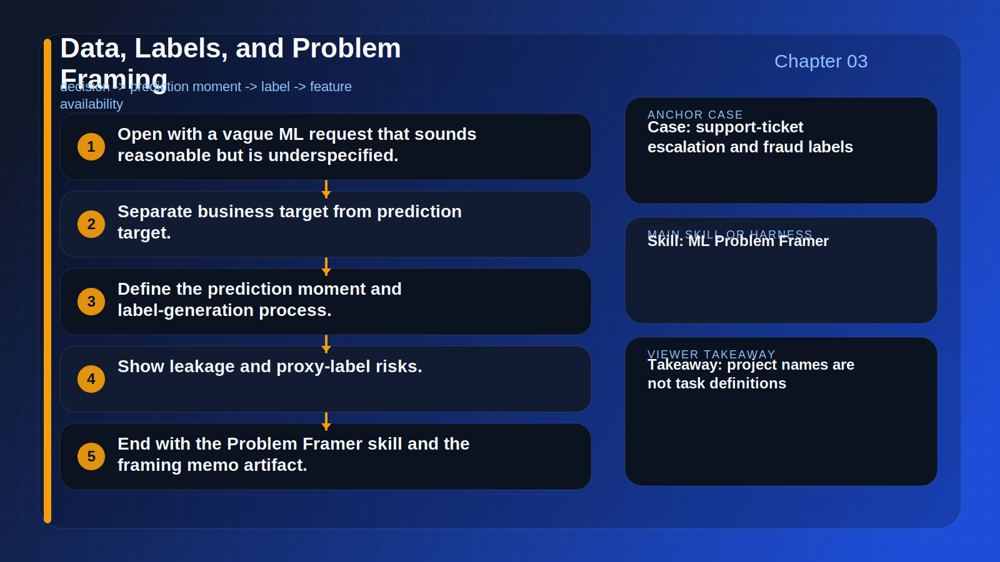
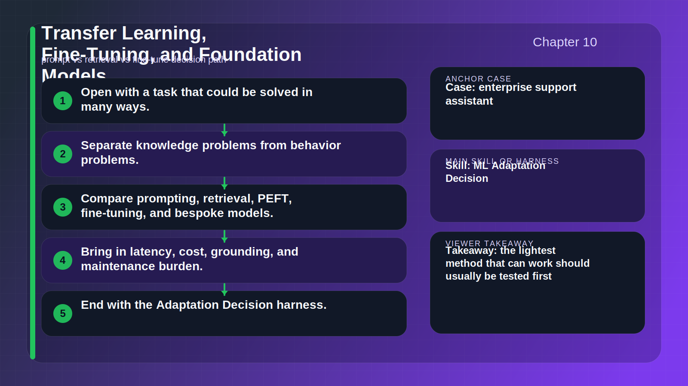
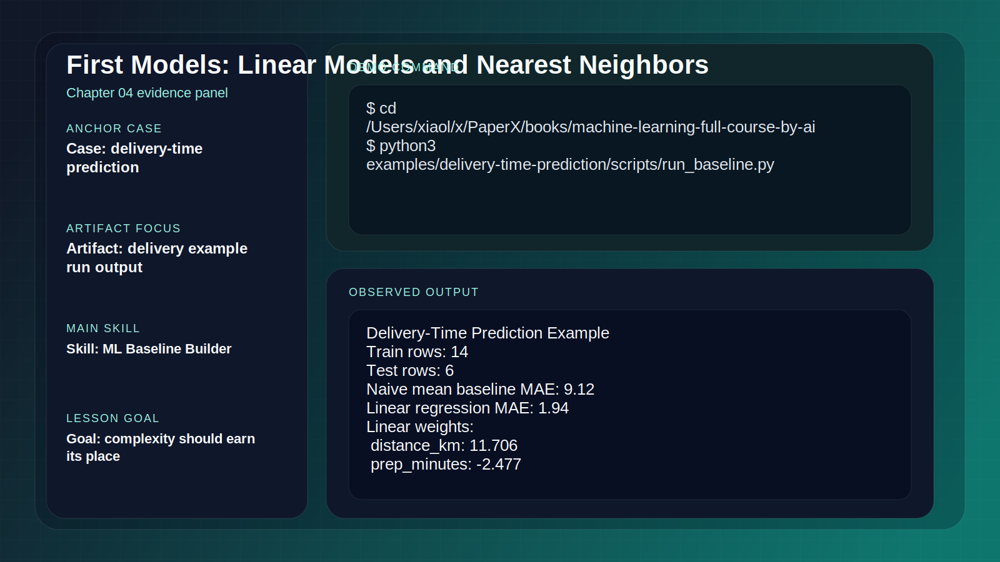
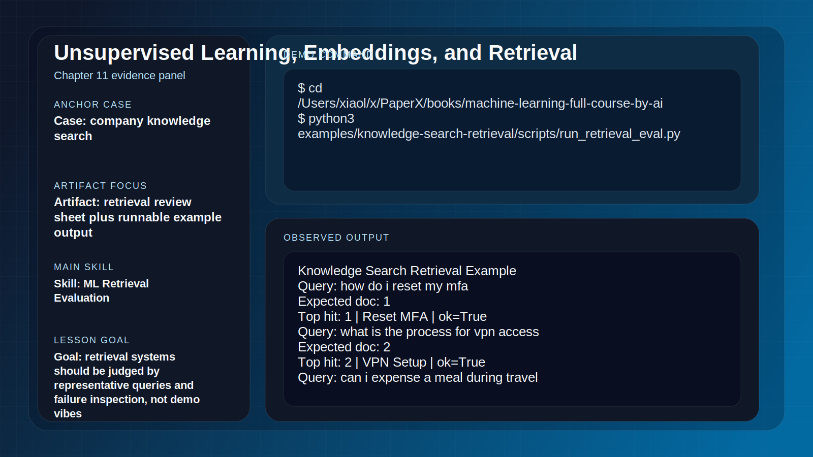

# Course Workspace Guide

This page is the bridge between the book manuscript and the video-production workspace.

If Appendix D explains *why* this book can become a strong AI-driven course, this page shows *where* the practical production assets live.

## What Is Already In The Repository

The repository already contains:

- the full mdBook manuscript
- runnable example cases
- reader skills the audience can try
- a dedicated `course/` production workspace
- generated chapter title cards for all 16 lessons

## Directory Map

```text
books/machine-learning-full-course-by-ai/
├── src/
│   ├── video-course.md
│   ├── course-workspace.md
│   └── assets/course-covers/
├── examples/
├── scripts/
│   └── generate_course_title_cards.py
└── course/
    ├── README.md
    ├── production-checklist.md
    ├── youtube-release-plan.md
    └── chapter-xx-.../
        ├── lesson-outline.md
        ├── voiceover.md
        ├── scene-cards.md
        ├── demo-commands.md
        └── assets/title-card.svg
```

## Production References

Use these files as the operating documents for course creation:

- `course/README.md`
- `course/production-checklist.md`
- `course/youtube-release-plan.md`

Use these book chapters as the teaching source:

- [How to Use Reader Skills with This Book](how-to-use-reader-skills.md)
- [Appendix B. Reader Skill Catalog](appendix-b.md)
- [Appendix C. Runnable Example Cases](examples.md)
- [Appendix D. From Book to AI-Driven Course Video](video-course.md)

## Sample Title Cards

These title cards are generated assets that can be used directly in editing software or refined into thumbnails.






## Sample Process Figures

Each chapter now also has a generated process figure based on the lesson outline and teaching flow.





## Sample Evidence Panels

Each chapter now has an evidence panel that turns the lesson's demo command or skill prompt into a visual capture target.

For the runnable chapters, the evidence panel includes real saved outputs from the repository.





## How To Use The Workspace

For each chapter:

1. open `lesson-outline.md` to confirm the teaching goal
2. refine `voiceover.md` into spoken narration
3. use `scene-cards.md` to plan the visual sequence
4. re-run `demo-commands.md` and capture evidence
5. place figures, screenshots, and chapter visuals into `assets/`
6. check the lesson against `course/production-checklist.md`

## Regenerating Chapter Title Cards

If you rename chapters or want to restyle the course covers, run:

```bash
cd books/machine-learning-full-course-by-ai
python3 scripts/generate_course_title_cards.py
```

This updates:

- `course/chapter-xx-.../assets/title-card.svg`
- `course/chapter-xx-.../assets/process-figure.svg`
- `course/chapter-xx-.../assets/evidence-panel.svg`
- `src/assets/course-covers/*.svg`
- `src/assets/course-process/*.svg`
- `src/assets/course-evidence/*.svg`

## Why This Matters

The goal is not only to have a finished book.

The goal is to have a repository where a reader can:

- study the chapter
- run the example
- try the skill
- inspect the evidence
- watch the lesson version later

That is what makes this project suitable for the future of learning rather than only for static reading.
