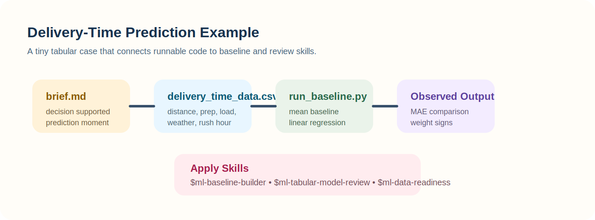
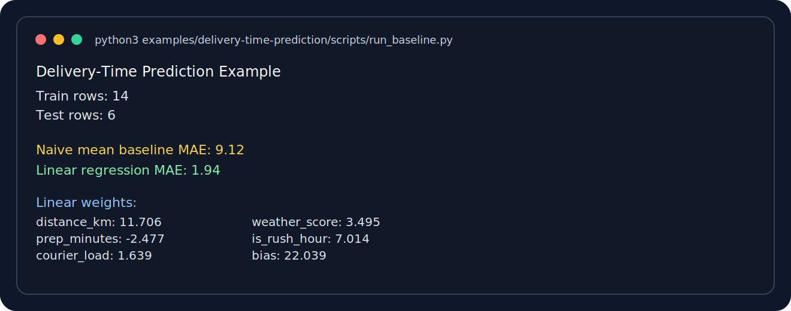
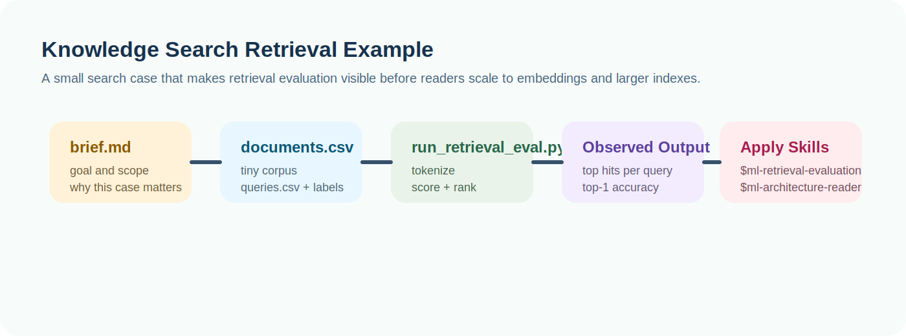
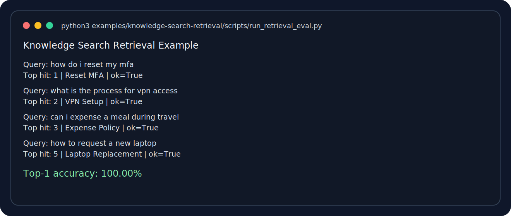
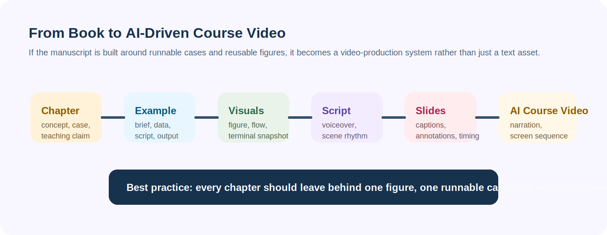

# Appendix C. Runnable Example Cases

The reader skills in this book are not only for discussion. Some of them can be paired with tiny local datasets and executable scripts so readers can see the full loop:

1. input artifacts
2. runnable code
3. observed output
4. skill-based review or judgment

Jupyter is not required. For this book, plain Python scripts are the default because they are easier to rerun, version, and explain.


## Where the runnable examples live

Repository path:

`books/machine-learning-full-course-by-ai/examples`

Convenience runner:

```bash
./scripts/run-example-cases.sh
```

## Example 1. Delivery-Time Prediction

Folder:

`examples/delivery-time-prediction/`

Files:

- `data/delivery_time_data.csv`
- `artifacts/brief.md`
- `artifacts/run-output.txt`
- `scripts/run_baseline.py`

Run it:

```bash
python3 examples/delivery-time-prediction/scripts/run_baseline.py
```



Sample output snapshot:



What happens:

- the script loads a tiny CSV dataset
- splits train and test rows
- computes a naive mean baseline
- fits a small linear regression baseline
- prints MAE and learned weights

Observed run artifact:

`examples/delivery-time-prediction/artifacts/run-output.txt`

Skills this supports:

- [ML Baseline Builder](reader-skills/ml-baseline-builder.md)
- [ML Tabular Model Review](reader-skills/ml-tabular-model-review.md)
- [ML Data Readiness](reader-skills/ml-data-readiness.md)

## Example 2. Knowledge Search Retrieval

Folder:

`examples/knowledge-search-retrieval/`

Files:

- `data/documents.csv`
- `data/queries.csv`
- `artifacts/brief.md`
- `artifacts/run-output.txt`
- `scripts/run_retrieval_eval.py`

Run it:

```bash
python3 examples/knowledge-search-retrieval/scripts/run_retrieval_eval.py
```



Sample output snapshot:



What happens:

- the script loads a tiny document set
- scores each document against each query with a simple lexical similarity method
- prints the top hit per query
- reports top-1 accuracy

Observed run artifact:

`examples/knowledge-search-retrieval/artifacts/run-output.txt`

Skills this supports:

- [ML Retrieval Evaluation](reader-skills/ml-retrieval-evaluation.md)
- [ML Architecture Reader](reader-skills/ml-architecture-reader.md)

## Recommended Reader Workflow

1. Run the script first.
2. Read the small artifact brief.
3. Invoke the corresponding skill with the observed outputs.
4. Compare your own judgment with the skill's structure.
5. Modify the dataset or script and rerun.

That sequence demonstrates the book's main idea: the reader should not only consume explanations. The reader should execute a case, inspect evidence, and use a reusable skill to reason about what happened.

If you want the exact skill workflow, use [How to Use Reader Skills with This Book](how-to-use-reader-skills.md) together with [Appendix B. Reader Skill Catalog](appendix-b.md).

## Why This Is Video-Ready

This structure is a strong foundation for an AI-driven course video.

Each runnable case already gives you:

- a story frame
- an artifact brief
- a process figure
- a real command to execute
- a screenshot-like output asset
- a skill-based interpretation layer

That is almost the full storyboard for a teaching video.



For later video production, each chapter should aim to leave behind:

1. one visual concept figure
2. one runnable example
3. one screenshot or terminal snapshot
4. one reusable skill prompt
5. one short voiceover outline
