# Architecture Gallery

Each variant below is a **Universal Transformer** with a matrix-state core (the **UniMatrix** family). Every image follows the Attention Residuals layout: (a) Universal Transformer baseline, (b) UniMatrix core, (c) UniMatrix variant.

## UniMatrix-Dynamic
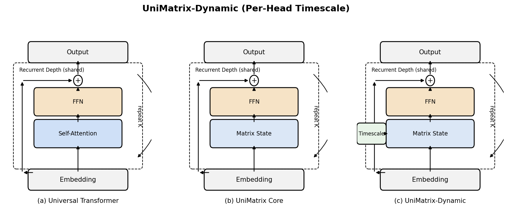

## UniMatrix-ROSA
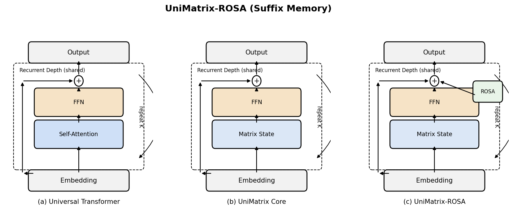

## UniMatrix-DeepEmbed
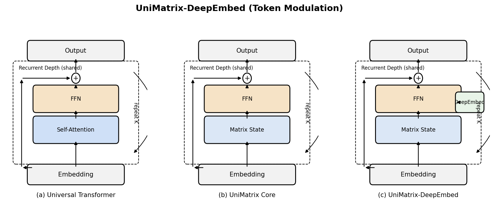

## UniMatrix-Structured
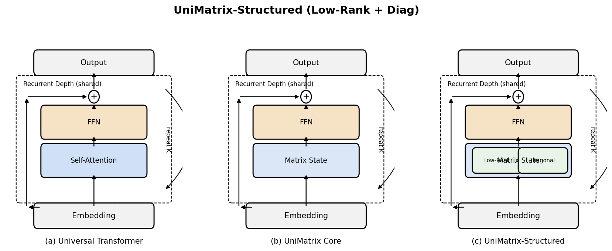

## UniMatrix-Hybrid
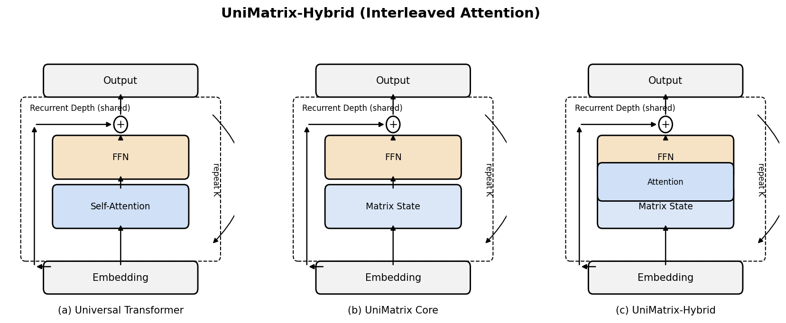

## UniMatrix-DualTimescale
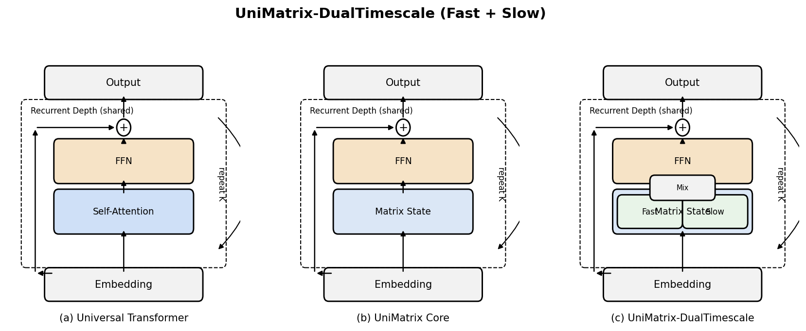

## UniMatrix-RuleMix
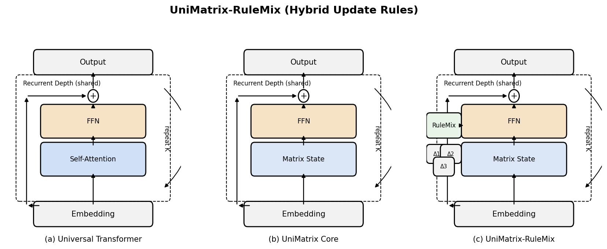

## UniMatrix-SkewStable
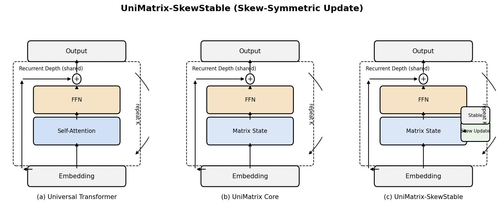

## UniMatrix-ConvMix
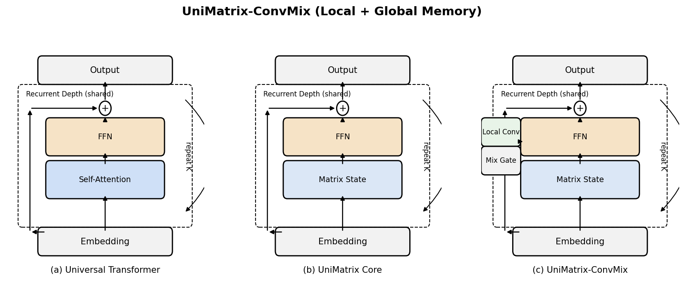

## UniMatrix-StepConditioned
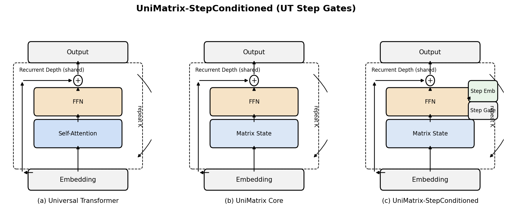

## UniMatrix-Spectral
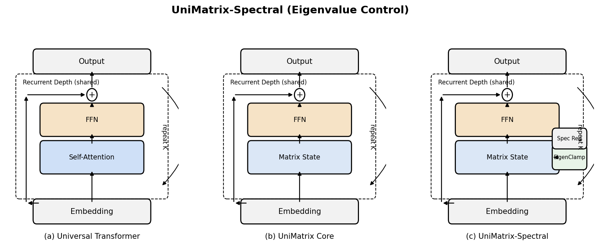

## UniMatrix-Discovery
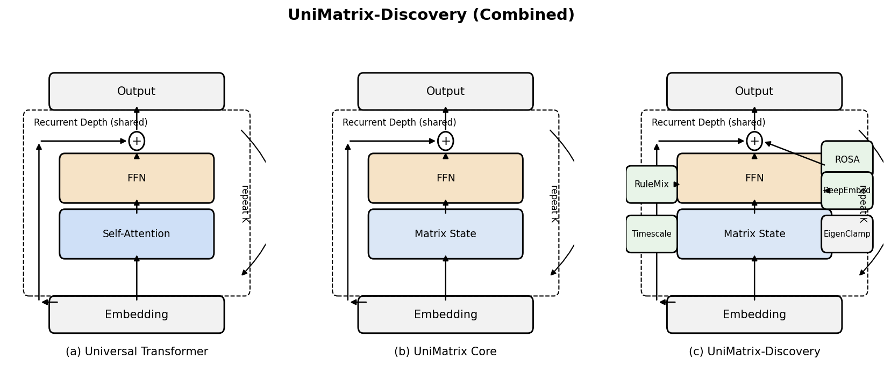

## UniMatrix-SparsePointer
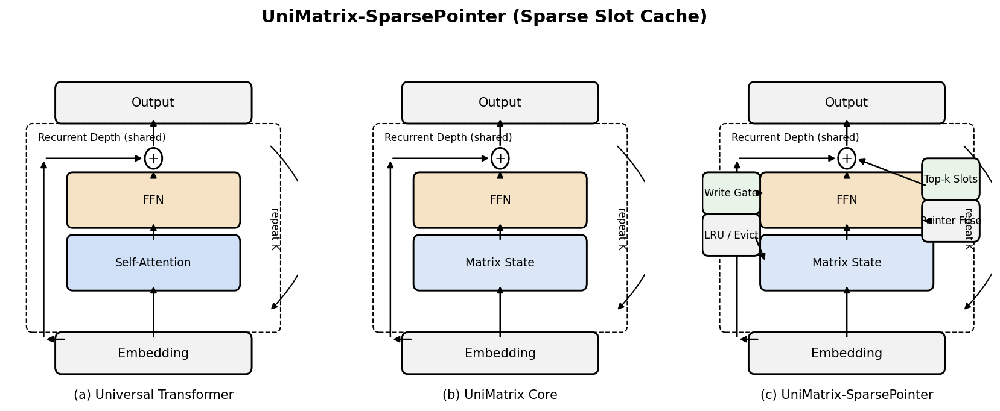

## UniMatrix-ProductKey
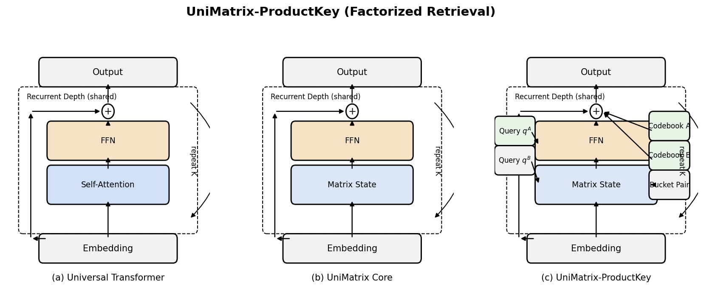

## UniMatrix-Relay
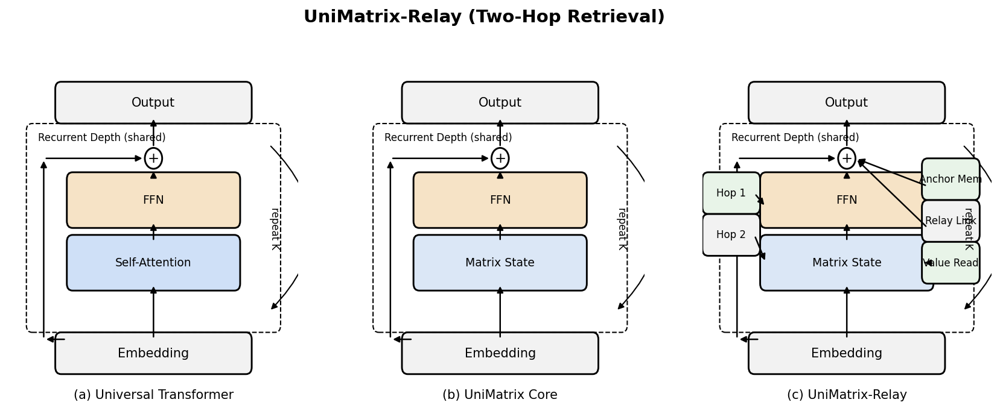
